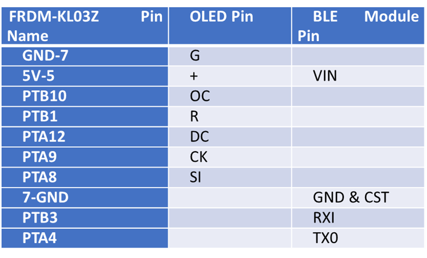
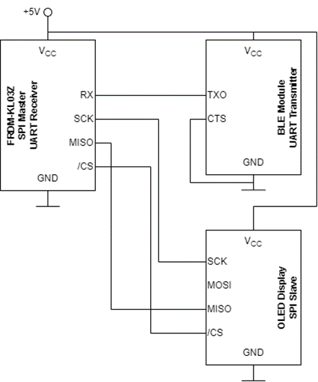

# 4B25 Final Project
Name: Muhammad Rizqi Nauval Afif

College: Lucy Cavendish

crsID: mrna2

Link to the project: https://github.com/nauvalafif/Warp-firmware/tree/coursework5uartnew

Link to comparison with the Warp-firmware master: https://github.com/physical-computation/Warp-firmware/compare/master...nauvalafif:coursework5uartnew

## 1.  Firmware
The firmware is currently all in `src/boot/ksdk1.1.0/`. The main program is in `src/boot/ksdk1.1.0/boot.c`. For firmware for sensors and peripherals that are used in this project, see `src/boot/ksdk1.1.0/devSSD1331.[c,h]` and `src/boot/ksdk1.1.0/devAdafruitBLEUARTFriend.[c,h]` 

The firmware builds on the Kinetis SDK. You can find more documentation on the Kinetis SDK in the document [doc/Kinetis SDK v.1.1 API Reference Manual.pdf](https://github.com/physical-computation/Warp-firmware/blob/master/doc/Kinetis%20SDK%20v.1.1%20API%20Reference%20Manual.pdf).

## 2. OLED Display (SSD1331)
The firmware for OLED display has been successfully created (`src/boot/ksdk1.1.0/devSSD1331.[c,h]`). There is a function `printText(char *text)` that takes `char *text` as an argument and will print the `text` in the display. Currently, it only supports standard Latin alphabet and space.

## 3. BLE Module (Adafruit Bluefruit LE UART Friend)
The BLE Module firmware has been successfully created in  `src/boot/ksdk1.1.0/devAdafruitBLEUARTFriend.[c,h]`. 

## 4. Pins table

## 5. Complete system diagram

## 6. Complete system photo
