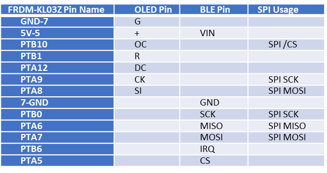
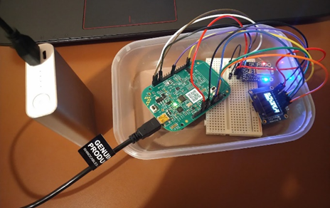
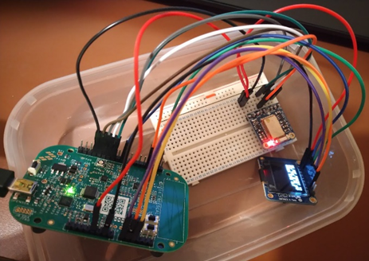

# 4B25 Final Project
Name: Muhammad Rizqi Nauval Afif

College: Lucy Cavendish

crsID: mrna2

Link to the project: https://github.com/nauvalafif/Warp-firmware/tree/coursework5

Link to comparison with the Warp-firmware master: https://github.com/physical-computation/Warp-firmware/compare/master...nauvalafif:coursework5

## 1.  Firmware
The firmware is currently all in `src/boot/ksdk1.1.0/`. The main program is in `src/boot/ksdk1.1.0/boot.c`. For firmware for sensors and peripherals that are used in this project, see `src/boot/ksdk1.1.0/devSSD1331.[c,h]` and `src/boot/ksdk1.1.0/devAdafruitBLESPIFriend.[c,h]` 

The firmware builds on the Kinetis SDK. You can find more documentation on the Kinetis SDK in the document [doc/Kinetis SDK v.1.1 API Reference Manual.pdf](https://github.com/physical-computation/Warp-firmware/blob/master/doc/Kinetis%20SDK%20v.1.1%20API%20Reference%20Manual.pdf).

## 2. OLED Display (SSD1331)
The firmware for OLED display has been successfully created (`src/boot/ksdk1.1.0/devSSD1331.[c,h]`). There is a function `printText(char *text)` that takes `char *text` as an argument and will print the `text` in the display. Currently it only supports standard Latin alphabet and space.

## 3. BLE Module (SSD1331)
I attempt to create the firmware in `src/boot/ksdk1.1.0/devAdafruitBLESPIFriend.[c,h]`, but have not succeeded yet. 

I have not succeeded in reading the message from BLE module. The [Adafruit Bluefruit LE SPI Friend datasheet](https://cdn-learn.adafruit.com/downloads/pdf/introducing-the-adafruit-bluefruit-spi-breakout.pdf) tells that the possible values of the most significant bit (MSB) of MISO message are 0x20, 0x40, and 0x80. Strangely, I always get a 0x28 MSB value whatever command message I send. Even the response is always the same: 0x 02860003FFFFFFFFFFFFFFFFFFFFFFFFFFFFFFFF.

## 4. Pins table

## 5. Complete system diagram

## 6. Complete system photo

## 7. Future Plan
I plan to do more research on how to read message from BLE particularly on the interrupt and SPI. If I am still not succeded, for the demonstration I plan to utilise J-Link RTT Client to write the message to the display.